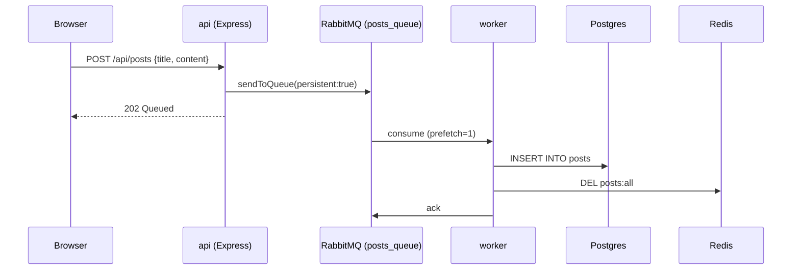
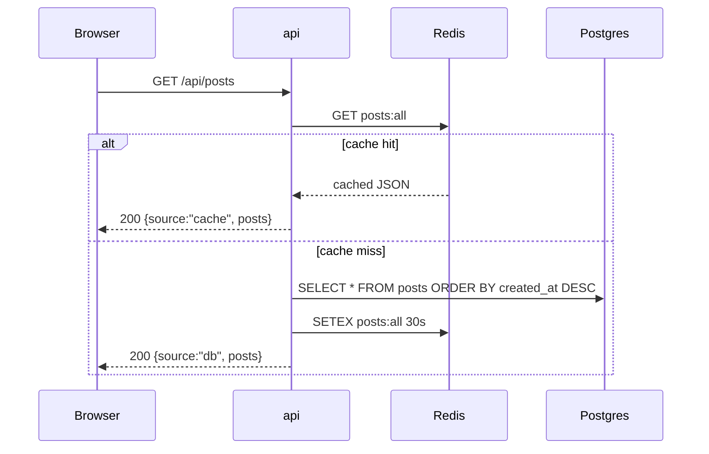

# Order Platform — Architecture & Local Run Guide

Single Docker Compose stack demonstrating cache-aside reads and queue-based
async writes. This is Phase 1 (Docker Compose on a single host). Phase 2+
(Terraform, kubeadm/EKS, ArgoCD, CI/CD) build on top of this without changing
application code — that constraint is intentional and is explained below.

## 1. What this actually is

6 containers. Not a microservices demo for its own sake — it's a deliberate
exercise in two patterns you'll need for the SRE/DevOps work: **cache-aside
reads** and **producer/consumer write decoupling**.

| Service    | Image                       | Role                                    |
|------------|------------------------------|------------------------------------------|
| `frontend` | node:20-alpine -> nginx:alpine | React SPA, built at image-build time, served by Nginx |
| `api`      | custom (Node/Express)        | Only service the frontend talks to. Read path + write path have different flows (see below) |
| `worker`   | custom (Node)                 | Sole consumer of the queue. Only process that writes to Postgres |
| `postgres` | postgres:16-alpine            | System of record. Schema created from `db/init.sql` on first boot |
| `redis`    | redis:7-alpine                 | Cache only, in front of `GET /api/posts` |
| `rabbitmq` | rabbitmq:3-management-alpine   | Queue between api (producer) and worker (consumer) |

**Root architectural decision: the API never writes to Postgres.** Every
`POST /api/posts` is published to RabbitMQ and immediately returns `202
Queued`. The worker is the only writer. This is not accidental — it means:

- The API can accept writes even if Postgres is briefly slow/unavailable
  (they just queue up).
- Write throughput is decoupled from Postgres throughput — you could scale
  worker replicas independently of API replicas.
- The tradeoff is **eventual consistency**: a client that POSTs and
  immediately re-fetches may not see its own write for ~1-2 seconds. The
  frontend papers over this with an optimistic "Queued!" message and a
  1.5s delayed refetch — it does **not** confirm the write actually
  succeeded in Postgres. If the worker crashes mid-processing, the UI will
  have already told the user "Queued!" for a post that never lands. Know
  this before you build anything that assumes read-your-own-write.

## 2. Request flow

### Write path



Key detail: `channel.prefetch(1)` in the worker means messages are processed
**one at a time, in order of arrival** on that worker instance. If you scale
worker replicas later, ordering across the whole queue is no longer
guaranteed — only per-consumer FIFO within RabbitMQ's delivery. If insert
order matters to you downstream, that's a design constraint to carry
forward into the Kubernetes phase (e.g. via a partition key or single
replica for this consumer group).

### Read path



Cache key: `posts:all`, TTL 30s. Invalidation is **explicit delete on
write** (in the worker, not TTL expiry) — this is cache-aside with active
invalidation, not pure TTL-based caching. That's the correct choice here:
it bounds staleness to the time between a write landing and the next read,
rather than up to 30s.

`GET /api/posts/search` bypasses Redis entirely and always hits Postgres
with an `ILIKE` scan on `title`/`content`. No index backs this — fine at
demo scale, but note it for later: `ILIKE '%term%'` can't use a standard
B-tree index (leading wildcard), so this doesn't scale past a small table
without `pg_trgm` + a GIN index, or moving search to something
purpose-built (Postgres full-text search, Elasticsearch/OpenSearch).

## 3. Why this stack (and what it's practicing)

| Pattern in this repo | Real infra equivalent later |
|---|---|
| `postgres`, `redis`, `rabbitmq` as container hostnames | Kubernetes DNS service discovery (`servicename.namespace.svc.cluster.local`) |
| `depends_on` + retry-loop connect in api/worker | Readiness probes / init containers in k8s |
| Env vars for all connection config | ConfigMaps + Secrets in k8s, or SSM Parameter Store / Secrets Manager on AWS |
| `PGHOST` pointed at a container | Swap to an RDS endpoint — zero app code changes |
| `REDIS_HOST` pointed at a container | Swap to an ElastiCache endpoint — zero app code changes |
| `RABBITMQ_HOST`, `amqplib` client | Swap to SQS (different client library — `api/index.js` and `worker/index.js` would need real changes here, unlike Postgres/Redis) |

This is why the compose file is worth understanding now rather than
skipping to Terraform: every environment variable you see here is a
stand-in for a value that will later come from a Kubernetes Secret or an
AWS-managed endpoint. Get the env var contract right now and the migration
is config-only.

## 4. Prerequisites

- Docker + Docker Compose. Nothing else — Node/Postgres/Redis/RabbitMQ are
  not needed on the host.

## 5. Running it

```bash
cd order-platform
docker compose up --build
```

First run pulls/builds images (~1-2 min). Then:

- App: http://localhost:3000
- API directly: http://localhost:4000/health
- RabbitMQ management UI: http://localhost:15672 (guest/guest) → Queues tab
  → `posts_queue` to watch messages arrive/drain in real time. This is the
  single most useful window into the system while debugging — use it
  before reaching for logs.

### Verifying the flow end-to-end

1. Open http://localhost:3000, submit a post. UI immediately shows
   "Queued!" — the post is **not yet in Postgres** at this point.
2. Watch `docker compose logs -f api worker` — you'll see the api log the
   publish, then (within ~1-2s) the worker log the save.
3. In the RabbitMQ UI, `posts_queue` message count will briefly go to 1,
   then back to 0 once the worker acks it.
4. Refresh the list: first fetch after a write is a cache miss
   (`source: "db"` — check the Network tab), fetches within the next 30s
   are cache hits (`source: "cache"`).
5. Search hits Postgres directly every time — no `source` field, no cache
   involved.

### Stopping / resetting

```bash
docker compose down       # stop, keep the postgres volume
docker compose down -v    # stop AND wipe postgres volume (clean-slate DB)
```

## 6. Debugging guide (map the symptom to the component)

| Symptom | Likely cause | Where to look |
|---|---|---|
| Frontend loads but posts never appear | Worker not connected to RabbitMQ, or Postgres not ready when worker started | `docker compose logs worker` — look for "RabbitMQ not ready, retrying" loop or a Postgres connection error |
| POST returns 500 "Failed to queue post" | API's RabbitMQ channel not established (still in its own retry loop, or `channel` is undefined because `connectQueue()` hasn't resolved) | `docker compose logs api` |
| POST accepted (202) but message count in RabbitMQ UI never drops | Worker crashed after connecting, or is nacking every message without requeue (see risk below) | `docker compose logs worker`; check `docker compose ps` for a restarted/exited worker container |
| Stale data served for longer than expected | You're reading within the 30s TTL window and no write has happened since — this is correct behavior, not a bug | Check `source` field in the API response; `docker exec -it redis redis-cli GET posts:all` to see what's cached, `TTL posts:all` for remaining time |
| Search returns nothing / errors | Postgres not reachable from `api`, or query syntax issue | `docker exec -it postgres psql -U postgres -d postsdb -c "SELECT * FROM posts;"` to confirm data exists independent of the API |
| `api` or `worker` container exits immediately on `docker compose up` | Both processes call `process.exit(1)` if `start()` rejects — happens if Redis is unreachable (no retry loop around `redisClient.connect()`, unlike the RabbitMQ connect logic) or RabbitMQ retries are exhausted (10 attempts, 3s apart = ~30s ceiling) | `docker compose logs <service>` immediately after the crash — the stack trace should be in the last lines before exit |

Useful direct-inspection commands:

```bash
docker compose logs -f api
docker compose logs -f worker
docker exec -it postgres psql -U postgres -d postsdb -c "SELECT * FROM posts;"
docker exec -it redis redis-cli GET posts:all
docker exec -it redis redis-cli TTL posts:all
docker compose ps
```

## 7. Known architectural gaps 
These aren't bugs to reflexively fix — they're scope decisions the current
code made for a local demo. Worth naming explicitly before building
Terraform/k8s around this, because some get more expensive to fix once
you're on managed infra.

- **No dead-letter queue.** `worker/index.js` does
  `channel.nack(msg, false, false)` on any processing error — `requeue:
  false` means a malformed or failing message is silently dropped, not
  retried, not preserved anywhere. In production this is a silent
  data-loss path. When you move to SQS, this is the point to introduce a
  DLQ with an alarm on depth > 0.
- **No idempotency key on writes.** A double-submit (double click, client
  retry after a timeout) creates two rows. Fine for a demo; not fine once
  this represents real orders. An idempotency key (client-generated UUID,
  checked against a unique constraint or a dedup cache) is the standard
  fix, and it's cheap to add now, before there's a migration to coordinate
  around.
- **No readiness distinction between "container started" and "service
  ready" for Redis/RabbitMQ.** Only Postgres has a `healthcheck` +
  `condition: service_healthy`. Redis and RabbitMQ use `condition:
  service_started`, which only means the container process launched, not
  that it's accepting connections. The RabbitMQ connect calls compensate
  with an explicit retry loop; the Redis connect call does not — it's a
  single `await redisClient.connect()` with no retry. This has worked so
  far because Redis starts fast, but it's not a guarantee, and it's exactly
  the kind of race that becomes a flaky pod restart in Kubernetes if you
  don't add a proper readiness probe.
- **Single worker replica implied by the design.** `prefetch(1)` plus no
  partitioning means scaling worker replicas is possible (RabbitMQ will
  round-robin), but you lose any implicit ordering guarantee across posts
  the moment you do. Decide if ordering matters before scaling this out.
- **Search is an unindexed `ILIKE` scan.** Works at demo data volumes.
  Needs `pg_trgm` + GIN index or a real search engine before this
  represents anything resembling production data volume.
- **Secrets are plaintext env vars in `docker-compose.yml`.** Acceptable
  for local-only Postgres/Redis/RabbitMQ credentials that never leave your
  machine. Not acceptable once these become Kubernetes Secrets or database
  credentials — that's a Phase 2/3 concern (Secrets Manager / SSM
  Parameter Store, External Secrets Operator, or Sealed Secrets, depending
  on what you choose to standardize on).

