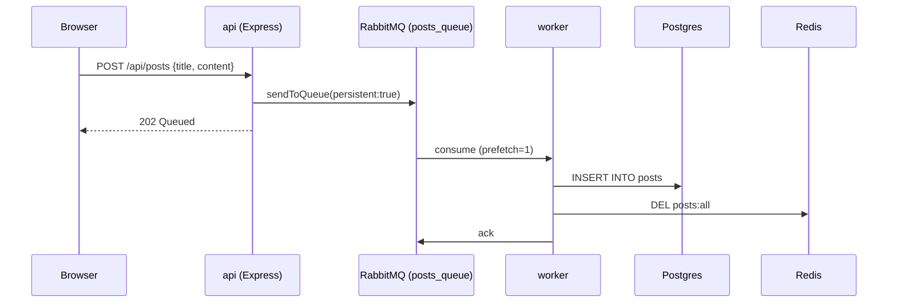
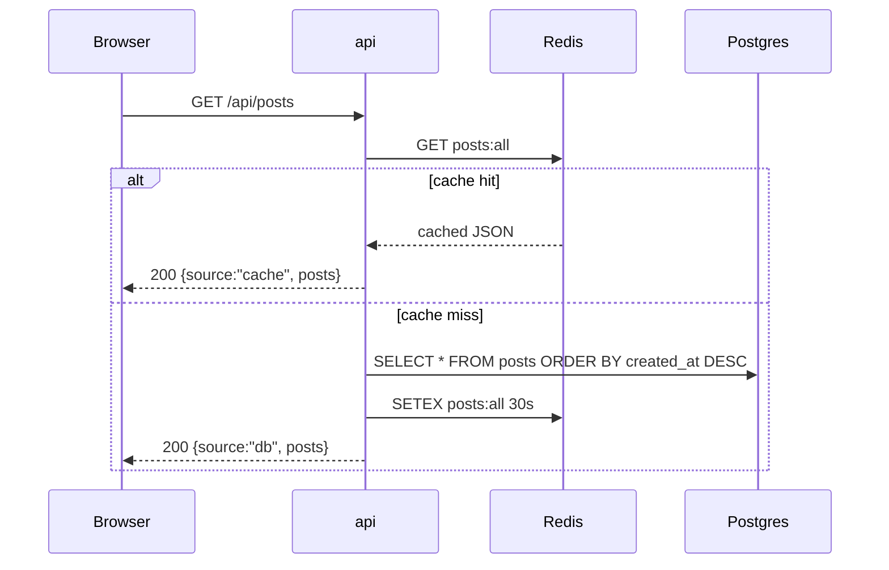

# Order Platform — Phase 2 Architecture (AWS Terraform, Dynamic Secrets & CI/CD)

## Scope of this phase

This document describes the **Phase 2 state** of the Order Platform architecture:
1. **Application Layer**: A 6-container micro-services stack (React Frontend, Express API, Async Node Worker, PostgreSQL, Redis, RabbitMQ) implementing cache-aside reads and decoupled queue-based async writes.
2. **Infrastructure Layer**: Fully provisioned on AWS via modular Terraform (`vpc`, `subnet`, `internet_gateway`, `route_table`, `elastic_ip`, `ec2`, `security_group`, `iam_role`, `oidc`).
3. **Configuration & Secrets**: Dynamic injection from AWS SSM Parameter Store at container startup—no plaintext credentials committed to Git or stored in static files.
4. **CI/CD Pipelines**: GitHub Actions workflows for automated secret scanning, vulnerability auditing, single-build container image pushing, SSH-based deployment with health checks, S3 version tracking, and automated rollback scripts.

Phase 3 (EKS, ArgoCD GitOps, Helm, External Secrets Operator) will build on this without requiring changes to the application code.

---

## 1. Container Architecture & Distributed Patterns

| Service | Build Source | Image / Base | Role & Infrastructure Pattern |
|---|---|---|---|
| `frontend` | `./frontend` | Multi-stage (`node:20-alpine` build -> `nginx:alpine` serve) | Serves React SPA static build on port `3000:80`. Bypasses Node runtime in production. |
| `api` | `./backend` | Custom Node/Express | Entrypoint for frontend. Handles read caching (Redis) and publishes writes to RabbitMQ. Public port `4000`. |
| `worker` | `./worker` | Custom Node | Async queue consumer (`prefetch(1)`). Sole process with PostgreSQL write privileges and cache invalidation duties (`DEL posts:all`). |
| `postgres` | Stock | `postgres:16-alpine` | System of record (`postsdb`). Schema initialized via `db/init.sql`. Internal port 5432 (localhost bound `127.0.0.1:5432`). |
| `redis` | Stock | `redis:7-alpine` | In-memory cache for `GET /api/posts` (30s TTL). Internal port 6379 (localhost bound `127.0.0.1:6379`). |
| `rabbitmq` | Stock | `rabbitmq:3-management-alpine` | Message queue (`posts_queue`) decoupling API writes from DB persistence. Management UI on port `15672` (SSH tunneled). |

---

## 2. Decoupled Read/Write Flows

### Write Flow (Async Producer / Consumer)



### Read Flow (Cache-Aside Pattern)



---

## 3. Infrastructure as Code (Terraform)

All cloud infrastructure is declared in `infra/` using a modular architecture separating reusable resource definitions (`infra/modules/`) from environment instantiation (`infra/environments/dev/`).

### Terraform Modules

| Module Path | AWS Resources Provisioned | Design Purpose |
|---|---|---|
| `infra/modules/vpc` | `aws_vpc`, `aws_subnet` | Creates VPC (`10.0.0.0/16`) and public subnet (`10.0.1.0/24`) in `ap-south-1a`. |
| `infra/modules/internet_gateway` | `aws_internet_gateway` | Attaches IGW to VPC for public internet connectivity. |
| `infra/modules/route_table` | `aws_route_table` | Configures `0.0.0.0/0` default route to IGW; associated with public subnet. |
| `infra/modules/elastic_ip` | `aws_eip`, `aws_eip_association` | Assigns static public IP to EC2 instance across reboots. |
| `infra/modules/security_group` | `aws_security_group` | Ingress rules for SSH (`var.ssh_ip`), HTTP (`80`), API (`4000`), App (`3000`), and VPC-internal traffic. |
| `infra/modules/ec2` | `aws_instance`, `aws_key_pair` | EC2 `t3.micro` instance running Docker + Docker Compose, provisioned with IAM Instance Profile. |
| `infra/modules/iam_role` | `aws_iam_role`, `aws_iam_instance_profile` | Grants EC2 read access to SSM Parameter Store (`/order-platform/*`) and read/write to deployment state in S3. |
| `infra/modules/oidc` | `aws_iam_openid_connect_provider`, `aws_iam_role` | Configures AWS IAM OIDC for GitHub Actions (`order_platform_github_actions_cd`), eliminating static AWS access keys. |

### Remote State with Native S3 Locking

State management uses Amazon S3 with native bucket locking (`use_lockfile = true` introduced in Terraform 1.10+):

```hcl
terraform {
  backend "s3" {
    bucket       = "order-platform-tf-state-891274465984"
    key          = "dev/terraform.tfstate"
    region       = "ap-south-1"
    use_lockfile = true
    encrypt      = true
  }
}
```

---

## 4. Configuration & Secrets Management (AWS SSM)

Secrets (Postgres password, RabbitMQ credentials, Docker Hub tokens) are stored in **AWS SSM Parameter Store** under `/order-platform/*`.

### Dynamic Secret Sourcing (`scripts/dev/fetch_secrets.sh`)

Rather than storing plaintext secrets in `docker-compose.yml` or static server `.env` files, secrets are retrieved dynamically at runtime on the EC2 instance:

```bash
# Fetches all parameters under /order-platform/ in a single API call
RESULT=$(aws ssm get-parameters-by-path \
  --path "/order-platform/" \
  --with-decryption \
  --region "ap-south-1" \
  --query "Parameters[*].[Name,Value]" \
  --output text)

# Converts /order-platform/pg-password -> PG_PASSWORD and exports to environment
while IFS=$'\t' read -r name value; do
  key=$(basename "$name" | tr '[:lower:]-' '[:upper:]_')
  export "$key"="$value"
done <<< "$RESULT"
```

The script must be **sourced** (`source scripts/dev/fetch_secrets.sh`) prior to executing `docker compose up -d` so variables pass directly into container environments.

---

## 5. CI/CD Workflows & Automated Deployment

Deployment is driven by two GitHub Actions workflows located in `.github/workflows/`:

### CI Pipeline (`.github/workflows/ci.yaml`)
1. **Secret Scanning**: Scans full repository history using `gitleaks`.
2. **Dependency Audit**: Runs `npm audit` on `backend`, `worker`, and `frontend`.
3. **Single Build, Dual Tagging**: Builds container images once using `docker/build-push-action`, tagging locally as `:scan` and remotely with `${{ github.sha }}`.
4. **Vulnerability Scanning**: Scans built images using `trivy` for `HIGH` and `CRITICAL` vulnerabilities.
5. **Registry Push**: Pushes Git-SHA tagged images to Docker Hub.
6. **Discord Alerts**: Sends pipeline execution status to Discord webhooks.

### CD Pipeline (`.github/workflows/cd.yaml`)
1. **Sparse Checkout**: Checks out only `docker-compose.yml` and `scripts/dev/`.
2. **Secure SCP Transfer**: Transfers compose definitions and deployment scripts to `/home/ubuntu/order-platform` on EC2 using SSH keys.
3. **OIDC & SSM Sourcing**: Authenticates via AWS IAM OIDC, sources SSM secrets via `fetch_secrets.sh`, and logs into Docker Hub.
4. **Zero-Build Pull & Deploy**: Runs `docker compose pull` and `docker compose up -d` with `IMAGE_TAG=${{ github.sha }}`.
5. **Automated Health Check Verification**: Executes a 15-attempt poll loop against `http://localhost:4000/health`.
6. **S3 Version History Shift**: On health check success, invokes `scripts/dev/update-version.sh` to update S3 deployment state.

---

## 6. Version Tracking & Rollback Mechanism

### Deployment Version History (`s3://$BUCKET/deploy/$ENV/versions.json`)

`scripts/dev/update-version.sh` maintains a 3-entry ring buffer on S3 tracking verified deployments:

```json
{
  "current": "commit-sha-new",
  "previous": "commit-sha-last-good",
  "oldest": "commit-sha-older"
}
```

### Manual & Automated Rollback (`scripts/dev/rollback.sh`)

If a deployment fails health checks or exhibits runtime failures:
1. `rollback.sh` downloads `versions.json` from S3.
2. Extracts the `current` known-good tag.
3. Re-sources SSM secrets (`fetch_secrets.sh`).
4. Re-executes `docker compose pull && docker compose up -d` using the known-good `IMAGE_TAG`.
5. Verifies health status after rollback.

---

## 7. Known Architectural Gaps & Phase 3 Roadmap

| Area | Current Phase 2 State | Planned Phase 3 Improvement |
|---|---|---|
| **Orchestration** | Docker Compose on single AWS EC2 instance | EKS (Elastic Kubernetes Service) cluster |
| **GitOps** | GitHub Actions SSH-based push deployment | ArgoCD pull-based GitOps reconciliation |
| **Secrets Engine** | AWS SSM Parameter Store + `fetch_secrets.sh` | External Secrets Operator (ESO) syncing AWS Secrets Manager directly into K8s Secrets |
| **Queue Resilience** | `channel.nack(msg, false, false)` drops failed messages | Dead Letter Queue (DLQ) with SQS/RabbitMQ + CloudWatch Depth Alarm |
| **Search Engine** | Unindexed `ILIKE` query scan in Postgres | PostgreSQL `pg_trgm` GIN index or OpenSearch / Elasticsearch cluster |
| **Database Scalability** | Single-container PostgreSQL instance | Managed AWS RDS PostgreSQL with Multi-AZ failover |