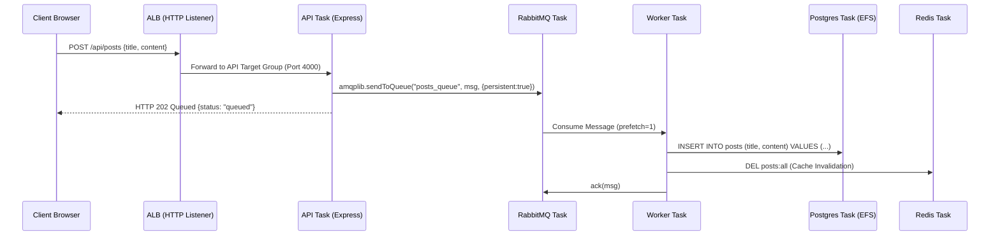
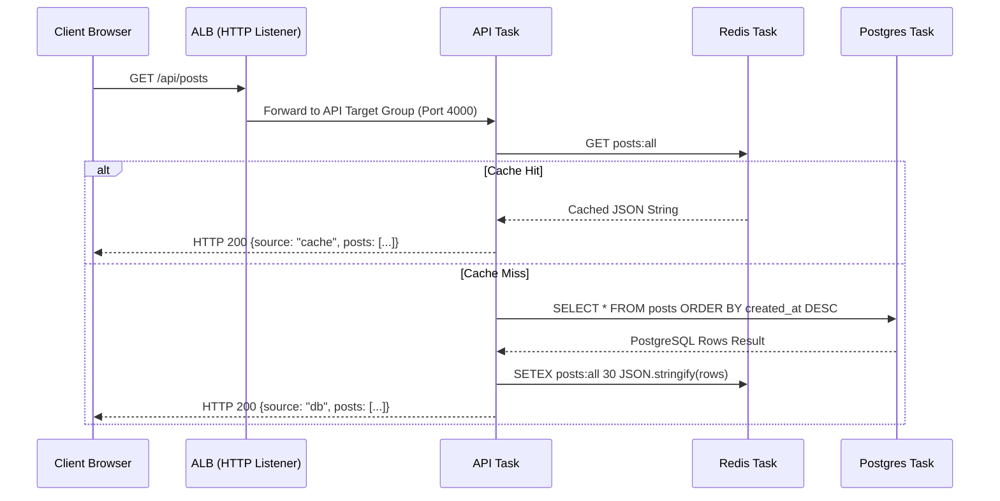

# Order Platform — Phase 2 Architecture (AWS ECS Fargate, ALB, Cloud Map & SSM)

## System Overview & Phase 2 Scope

This document details the **Phase 2 production architecture** of the Order Platform application, running on AWS managed container infrastructure using **AWS ECS (Elastic Container Service) with AWS Fargate**:

```
                               ┌───────────────────────────┐
                               │   Internet Traffic (HTTP) │
                               └─────────────┬─────────────┘
                                             │
                                             ▼
                               ┌───────────────────────────┐
                               │ Application Load Balancer │
                               │        (Public ALB)       │
                               └─────────────┬─────────────┘
                                             │
                       ┌─────────────────────┴─────────────────────┐
             Path: /*  │                                  Path: /api/* & /health
                       ▼                                           ▼
          ┌──────────────────────────┐                ┌──────────────────────────┐
          │   Frontend Target Group  │                │     API Target Group     │
          └────────────┬─────────────┘                └────────────┬─────────────┘
                       │                                           │
                       ▼                                           ▼
          ┌──────────────────────────┐                ┌──────────────────────────┐
          │  Frontend Task (Fargate) │                │    API Task (Fargate)    │
          └──────────────────────────┘                └────────────┬─────────────┘
                                                                   │
                                                ┌──────────────────┴──────────────────┐
                                                │ (Cloud Map: order-platform.local)   │
                                                ▼                                     ▼
                                      ┌──────────────────┐                  ┌──────────────────┐
                                      │   Redis Task     │                  │  RabbitMQ Task   │
                                      │ (Cache, 30s TTL) │                  │ (Message Queue)  │
                                      └──────────────────┘                  └────────┬─────────┘
                                                                                     │ Consume
                                                                                     ▼
                                      ┌──────────────────┐                  ┌──────────────────┐
                                      │  PostgreSQL Task │◄─────────────────│   Worker Task    │
                                      │  (EFS Persistent)│     INSERT       │ (Queue Consumer) │
                                      └──────────────────┘                  └──────────────────┘
```

### Key Architectural Pillars
1. **Serverless Container Compute (AWS Fargate)**: Eliminates EC2 instance management, OS patching, and host-level SSH keys. Tasks execute on AWS-managed capacity across multiple Availability Zones.
2. **Public Ingress & Routing (AWS ALB)**: Dual-AZ Application Load Balancer providing single-entrypoint TLS/HTTP routing:
   - Path `/*` -> Frontend Target Group (`port 80`, `target_type = "ip"`).
   - Path `/api/*` and `/health` -> API Target Group (`port 4000`, `target_type = "ip"`).
3. **Private Service Discovery (AWS Cloud Map)**: Container-to-container network resolution via private Route53 DNS namespace (`order-platform.local`). Applications resolve `postgres`, `redis`, and `rabbitmq` hostnames natively without hardcoded IPs.
4. **Persistent Database Storage (AWS EFS)**: PostgreSQL state is persisted using Amazon EFS with POSIX access points (`uid: 999`, `gid: 999`), ensuring data durability across container restarts and rescheduling.
5. **IAM-Native Secret Injection (AWS SSM Parameter Store)**: Plaintext secrets are removed from static files. The ECS Agent uses the `ecsTaskExecutionRole` to fetch encrypted secrets from Parameter Store (`/order-platform/*`) at container initialization, injecting them directly into container environment variables.
6. **Continuous Delivery (GitHub Actions OIDC & ECS Circuit Breaker)**: Passwordless AWS authentication via OpenID Connect (OIDC). Deployments trigger rolling task updates with automated circuit-breaker rollbacks if health checks fail.

---

## 1. Component & Container Specification Matrix

| Service | Container Base | CPU / Memory | Network & Storage | Infrastructure Role |
|---|---|---|---|---|
| `frontend` | `node:20-alpine` -> `nginx:alpine` | `256` (0.25 vCPU) / `512 MB` | Port `80` (ALB Target Group) | Static React SPA served via Nginx. |
| `api` | Node 20 Express | `256` (0.25 vCPU) / `512 MB` | Port `4000` (ALB Target Group) | REST API. Handles read caching via Redis & publishes write messages to RabbitMQ. |
| `worker` | Node 20 | `256` (0.25 vCPU) / `512 MB` | Internal (No open ports) | Async background consumer (`prefetch=1`). Writes to PostgreSQL and invalidates Redis cache key (`DEL posts:all`). |
| `postgres` | `postgres:16-alpine` | `256` (0.25 vCPU) / `512 MB` | Port `5432` + EFS Volume (`/var/lib/postgresql/data`) | Relational database (`postsdb`). Cloud Map DNS: `postgres.order-platform.local`. |
| `redis` | `redis:7-alpine` | `256` (0.25 vCPU) / `512 MB` | Port `6379` | In-memory cache layer (`posts:all`, 30s TTL). Cloud Map DNS: `redis.order-platform.local`. |
| `rabbitmq` | `rabbitmq:3-management-alpine` | `256` (0.25 vCPU) / `512 MB` | Ports `5672` (AMQP) & `15672` (Mgmt UI) | Asynchronous queue (`posts_queue`). Cloud Map DNS: `rabbitmq.order-platform.local`. |

---

## 2. Decoupled Read / Write Request Flows

### Write Path (Asynchronous Producer / Consumer)



### Read Path (Cache-Aside Pattern)



---

## 3. Modular Terraform Architecture (`infra/`)

The infrastructure codebase is organized into reusable modules (`infra/modules/`) instantiated by root environment configurations (`infra/environments/dev/`).

```
infra/
├── environments/
│   └── dev/
│       ├── main.tf              # Root module orchestration & S3 backend
│       ├── variables.tf         # Environment input variables
│       ├── outputs.tf           # Environment outputs (ALB DNS, Role ARNs)
│       ├── terraform.tfvars     # Environment specific parameters
│       └── backend.tf
└── modules/
    ├── vpc/                     # Multi-AZ VPC and Public Subnets
    ├── internet_gateway/        # AWS Internet Gateway
    ├── route_table/             # Route Tables and Associations
    ├── security_group/          # ALB SG and ECS Tasks SG
    ├── alb/                     # ALB, Target Groups (IP mode), Listeners
    ├── service_discovery/       # AWS Cloud Map Private DNS Namespace
    ├── efs/                     # AWS EFS File System, Mount Targets, Access Point
    ├── ecs/                     # ECS Cluster, Task Definitions, Fargate Services
    ├── iam_role/                # ECS Execution Role & Task Roles
    └── oidc/                    # GitHub Actions AWS OIDC Provider & Roles
```

### Module Descriptions

#### 1. `infra/modules/vpc`
* **AWS Resources**: `aws_vpc`, `aws_subnet` (Subnet A in `ap-south-1a`, Subnet B in `ap-south-1b`).
* **Design Purpose**: Provision a multi-AZ VPC (`10.0.0.0/16`) with dual public subnets (`10.0.1.0/24` and `10.0.2.0/24`) to meet AWS Application Load Balancer high-availability requirements.

#### 2. `infra/modules/alb`
* **AWS Resources**: `aws_lb`, `aws_lb_target_group` (`frontend`, `api`), `aws_lb_listener`, `aws_lb_listener_rule`.
* **Design Purpose**: Exposes an internet-facing Application Load Balancer. Target groups use `target_type = "ip"` required for Fargate tasks operating in `awsvpc` network mode. Configures health check endpoints (`/` for frontend, `/health` for API).

#### 3. `infra/modules/service_discovery`
* **AWS Resources**: `aws_service_discovery_private_dns_namespace`, `aws_service_discovery_service`.
* **Design Purpose**: Creates a private DNS namespace (`order-platform.local`) integrated with Route53. Automatically registers A-records for container tasks (`postgres`, `redis`, `rabbitmq`), eliminating the need for hardcoded container IP addresses.

#### 4. `infra/modules/efs`
* **AWS Resources**: `aws_efs_file_system`, `aws_efs_mount_target`, `aws_efs_access_point`.
* **Design Purpose**: Provides encrypted, elastic NFS storage for PostgreSQL. Mount targets are placed in both public subnets, and an access point enforces POSIX ownership (`uid: 999`, `gid: 999`).

#### 5. `infra/modules/ecs`
* **AWS Resources**: `aws_ecs_cluster`, `aws_cloudwatch_log_group`, `aws_ecs_task_definition` (6 task families), `aws_ecs_service` (6 Fargate services).
* **Design Purpose**: Manages container orchestration on Fargate. Defines container CPU/RAM sizing, `awslogs` log drivers streaming to `/ecs/order-platform`, SSM secret bindings, EFS volume mounts, Cloud Map service registrations, and ALB target group attachments.

#### 6. `infra/modules/security_group`
* **AWS Resources**: `aws_security_group` (`alb_sg`, `ecs_tasks_sg`), `aws_vpc_security_group_ingress_rule`, `aws_vpc_security_group_egress_rule`.
* **Design Purpose**: Implements defense-in-depth networking:
  - `alb_sg`: Allows inbound HTTP (80) and HTTPS (443) from `0.0.0.0/0`.
  - `ecs_tasks_sg`: Allows inbound HTTP traffic on ports 80 & 4000 *only* from `alb_sg`, permits all VPC-internal traffic (`10.0.0.0/16`) for inter-container calls (5432, 6379, 5672, 2049), and allows all outbound traffic.

#### 7. `infra/modules/iam_role`
* **AWS Resources**: `aws_iam_role` (`ecs_execution_role`, `ecs_task_role`), `aws_iam_role_policy_attachment`, `aws_iam_role_policy`.
* **Design Purpose**: Creates IAM roles for ECS:
  - `ecs_execution_role`: Attached to `AmazonECSTaskExecutionRolePolicy` + inline SSM policy allowing `ssm:GetParameters` on `arn:aws:ssm:ap-south-1:*:parameter/order-platform/*`.
  - `ecs_task_role`: Granted to container task runtimes.

#### 8. `infra/modules/oidc`
* **AWS Resources**: `aws_iam_openid_connect_provider`, `aws_iam_role` (`order_platform_github_actions_cd`), `aws_iam_role_policy`.
* **Design Purpose**: Establishes OpenID Connect trust between GitHub Actions and AWS. Grants GitHub Actions permission to assume `order_platform_github_actions_cd` and execute ECS service deployments (`ecs:RegisterTaskDefinition`, `ecs:UpdateService`, `iam:PassRole`).

---

## 4. State Management with Native S3 Locking

Terraform state is stored centrally in AWS S3 using S3 native state locking (`use_lockfile = true` available in Terraform 1.10+):

```hcl
terraform {
  backend "s3" {
    bucket       = "order-platform-tf-state-891274465984"
    key          = "dev/terraform.tfstate"
    region       = "ap-south-1"
    use_lockfile = true
    encrypt      = true
  }
}
```

This prevents concurrent `terraform apply` operations without needing a separate DynamoDB table.

---

## 5. Configuration & Secrets Management

Application parameters and sensitive credentials are stored in **AWS SSM Parameter Store**:

| Parameter Name | Type | Container Environment Variable | Target Container |
|---|---|---|---|
| `/order-platform/pg-password` | `SecureString` | `POSTGRES_PASSWORD` / `PGPASSWORD` | `postgres`, `api`, `worker` |
| `/order-platform/rabbitmq-user` | `SecureString` | `RABBITMQ_DEFAULT_USER` / `RABBITMQ_USER` | `rabbitmq`, `api`, `worker` |
| `/order-platform/rabbitmq-password` | `SecureString` | `RABBITMQ_DEFAULT_PASS` / `RABBITMQ_PASSWORD` | `rabbitmq`, `api`, `worker` |

### Native ECS Secret Binding

Secrets are declared inside ECS Task Definitions using the `secrets` JSON block:

```json
"secrets": [
  {
    "name": "PGPASSWORD",
    "valueFrom": "arn:aws:ssm:ap-south-1:123456789012:parameter/order-platform/pg-password"
  }
]
```

During container launch, the ECS Agent uses the `ecsTaskExecutionRole` to fetch the parameter from SSM and injects it directly into the process environment variables.

---

## 6. CI/CD Workflows & Continuous Deployment

Automated pipelines are defined in `.github/workflows/`:

### 1. CI Workflow (`.github/workflows/ci.yaml`)
- **Secret Scan**: Scans commit history using `gitleaks`.
- **Dependency Audit**: Runs `npm audit` across Node codebases.
- **Docker Build & Scan**: Performs single-build dual-tagging (`:scan` for local scan, `${{ github.sha }}` for remote push) and scans images using `trivy`.
- **Registry Push**: Pushes Git-SHA tagged images to Docker Hub.
- **Notification**: Posts build results to Discord webhooks.

### 2. CD Workflow (`.github/workflows/cd.yaml`)
- **AWS Authentication**: Authenticates using `aws-actions/configure-aws-credentials` with OIDC.
- **Task Definition Update**: Renders updated container task definitions with the new `${{ github.sha }}` image tag using `aws-actions/amazon-ecs-render-task-definition`.
- **Fargate Rolling Deployment**: Deploys updated task definitions using `aws-actions/amazon-ecs-deploy-task-definition`.
- **Automated Circuit Breaker**: ECS monitors target group health checks (`/health` and `/`). If a new task fails health checks, ECS aborts the deployment and rolls back to the previous healthy task definition automatically.

---

## 7. Future Evolution (Phase 3 Roadmap)

| Capability | Phase 2 (Current) | Phase 3 (Planned) |
|---|---|---|
| **Orchestration** | AWS ECS on Fargate | AWS EKS (Elastic Kubernetes Service) |
| **GitOps Engine** | GitHub Actions Push Deployment | ArgoCD Pull Reconciliation |
| **Secrets Engine** | AWS SSM Parameter Store + ECS Secret Injection | External Secrets Operator (ESO) + K8s Secrets |
| **Managed Persistence** | Containerized PostgreSQL + EFS | AWS RDS PostgreSQL Multi-AZ |
| **Managed Cache** | Containerized Redis | AWS ElastiCache for Redis Cluster |